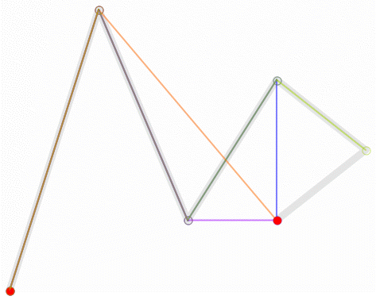

# 贝赛尔曲线

## 原理

贝塞尔曲线由起点、终点\(也称锚点\)和若干个控制点决定

以二阶为例

**已知不共线3点A、B、C，依次连接线段AB、BC，分别取AB、BC中D、E，使得AD:AB = BE:BC，连接DE，取DE上F，使得DF:DE = AD:AB = BE:BC。利用极限知识，让D点从A移动到B，找到所有的F点，这些点形成的曲线便是贝塞尔曲线。**

一条曲线可在任意点切割成两条或任意多条子曲线，每一条子曲线仍是贝塞尔曲线

n阶贝塞尔曲线可以看成二阶贝塞尔曲线组成

PS中的钢笔通过锚点来绘制曲线

## 公式

引入参数t，t满足区间\[0, 1\]，t的取值代表比例，**DF:DE = AD:AB = BE:BC = t。**

$$P_0B_t ： P_0P_1 = t$$

### 一阶贝塞尔曲线

$$(B_t - P_0) / (P_1 - P_0) = t$$

根据以上公式可得

$$B_t = P_0 + (P_1 - P_0)t = (1 - t)P_0 + tP_1 (1)$$

### 二阶贝塞尔曲线

$$B_a = P_0 + (P_1 - P_0)t = (1 - t)P_0 + tP_1 (2)$$

$$B_b = P_1 + (P_2 - P_1)t = (1 - t)P_1 + tP_2 (3)$$

$$B_t = P_a + (P_b - P_a)t = (1 - t)P_a + tP_b (4)$$

将公式\(2\)\(3\)代入公式\(4\)中，可得

$$P_t = (1-t)P_a + tP_b = (1-t)[(1-t)P_0 + tP_1] + t[(1-t)P_1 + tP_2] = (1-t)^2P_0 + 2(1-t)tP_1 + t^2P_2 (5)$$

### 三阶贝塞尔曲线

同理，根据以上的推导过程可得

$$P_a = P_0 + (P_1 - P_0)t = (1 - t)P_0 + tP_1$$

$$P_b = P_1 + (P_2 - P_1)t = (1 - t)P_1 + tP_2$$

$$P_c = P_2 + (P_3 - P_2)t = (1 - t)P_2 + tP_3$$

$$P_d = P_a + (P_b - P_a)t = (1 - t)P_a + tP_b$$

$$P_e = P_b + (P_c - P_b)t = (1 - t)P_b + tP_c$$

由此可以推导

$$P_t = P_d + (P_e - P_d)t = (1 - t)P_d + tP_e = (1-t)[(1 - t)P_a + tP_b] + t[(1 - t)P_b + tP_c] = (1-t)^2P_a + 2(1-t)tP_b + t^2P_c = (1-t)^2[(1 - t)P_0 + tP_1] + 2(1-t)t[(1 - t)P_1 + tP_2] + t^2[(1 - t)P_2 + tP_3] = (1 - t)^3P_0 + (1 - t)^2tP_1 + 2t(1 - t)^2P_1 + 2t^2(1-t)P_2 + t^2(1-t)P_2 + t^3P_3 = (1-t)^3P_0 + 3t(1-t)^2tP_1 + 2t^2(1-t)P_2 + t^3P_3$$

### n阶贝塞尔曲线

